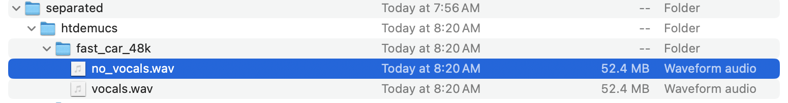

# demultiplex music

The
[`demucs` ML model](https://github.com/adefossez/demucs)
separates `vocals`, `drums`, `bass` and `other` tracks from music.

The source repo licence is the permissive MIT.

- [demultiplex music](#demultiplex-music)
- [Installating demucs](#installating-demucs)
  - [Python version](#python-version)
  - [Virtual enviroment](#virtual-enviroment)
- [Runs](#runs)
  - [Run1](#run1)
  - [Run2 --two-stems=vocals](#run2---two-stemsvocals)
  - [System load](#system-load)
- [Next steps](#next-steps)

# Installating demucs

Tested on MacBook Pro 2020 (Intel x86) with macOS 15.5.

## Python version

I used `pyenv` [repo](https://github.com/pyenv/pyenv) to install a suitable
Python version on macOS.  The model uses PyTorch which does not support Python
3.13 as of June 14, 2025.
```sh
python3 --version
```
```console
Python 3.12.3
```

## Virtual enviroment

Create a virtual environment.  I used Python's `venv` for this.
```sh
cd
python3 -m venv venv_demucs
source ./venv_demucs/bin/activate

python3 -m pip install --upgrade pip
```

Install
[`demucs` PyPI package](https://pypi.org/project/demucs/)
in the virtual environment.
```sh
python3 -m pip install -U demucs
```

I hit a numpy version error triggered in `/torch/nn/modules/transformer.py`.
```sh
demucs
```
```console
A module that was compiled using NumPy 1.x cannot be run in
NumPy 2.3.0 as it may crash. To support both 1.x and 2.x
versions of NumPy, modules must be compiled with NumPy 2.0.
Some module may need to rebuild instead e.g. with 'pybind11>=2.12'.

If you are a user of the module, the easiest solution will be to
downgrade to 'numpy<2' or try to upgrade the affected module.
We expect that some modules will need time to support NumPy 2.
```
I downgraded numpy in the virtual environment to version 1.26.4.
```sh
python3 -m pip install "numpy<2"
```

# Runs

Run from command line in the virtual environment.
```sh
cd
source ./venv_demucs/bin/activate

demucs <path_to_music_file>
```

## Run1

I tested on a mono file with 1 track with 48kHz sampling rate.  A random file in
my downloads folder.  The run took 4m13s.
```console
(venv_demucs) $ demucs Downloads/fast_car_48k.wav
Important: the default model was recently changed to `htdemucs` the latest Hybrid Transformer Demucs model. In some cases, this model can actually perform worse than previous models. To get back the old default model use `-n mdx_extra_q`.
Downloading: "https://dl.fbaipublicfiles.com/demucs/hybrid_transformer/955717e8-8726e21a.th" to /Users/guynicholson/.cache/torch/hub/checkpoints/955717e8-8726e21a.th
100%|████████████████████████████████████████████████████████████████████████████████| 80.2M/80.2M [00:01<00:00, 62.8MB/s]
Selected model is a bag of 1 models. You will see that many progress bars per track.
Separated tracks will be stored in /Users/guynicholson/separated/htdemucs
Separating track Downloads/fast_car_48k.wav
100%|██████████████████████████████████████████████| 298.34999999999997/298.34999999999997 [04:13<00:00,  1.18seconds/s]
(venv_demucs) $
```
An 80MB model file was downloaded to the cache in the above step.

After the run I found four generated WAV files in the `separated/htdemucs`
sub-folder.  Each file has 44.1kHz sampling rate.


I was impressed on my first listen.
1. All tracks have the expected separation.  There are some quiet artifacts such as modulation and bleed-through from other tracks.  Reverberation timbre can sound modulated.
2. The `vocals ` track preserves the singing timbre and artist identity.

## Run2 --two-stems=vocals

The `--two-stems=vocals` option allows separating vocals from the rest of the
accompaniment (i.e., "karaoke" mode). vocals can be changed to any source in the
selected model.  Before running this I renamed the sub-folder generated in run1.
```sh
cd
source ./venv_demucs/bin/activate

demucs Downloads/fast_car_48k.wav --two-stems=vocals
```

The run took 3m49s.
```console
(venv_demucs) $ demucs Downloads/fast_car_48k.wav --two-stems=vocals
Important: the default model was recently changed to `htdemucs` the latest Hybrid Transformer Demucs model. In some cases, this model can actually perform worse than previous models. To get back the old default model use `-n mdx_extra_q`.
Selected model is a bag of 1 models. You will see that many progress bars per track.
Separated tracks will be stored in /Users/guynicholson/separated/htdemucs
Separating track Downloads/fast_car_48k.wav
100%|██████████████████████████████████████████████| 298.34999999999997/298.34999999999997 [03:49<00:00,  1.30seconds/s]
(venv_demucs) $
```

This generated two WAV files.


I was impressed on my first listen.
1. All tracks have the expected separation.
2. The `no_vocals` track has a very quiet slightly ghostly sounding vocal.
3. The `vocals` track sounded the same as in run1.

## System load

I ran these on MacBook Pro 2020 (Intel) with quad-core i5 and 16GB
RAM.  The `python3.12` process used all four cores up to ~380% and memory usage
was in range [1, 1.3] GB.

# Next steps
* [ ] Try demucs on Linux.
* [ ] Dataset labelling using Python scripting.
